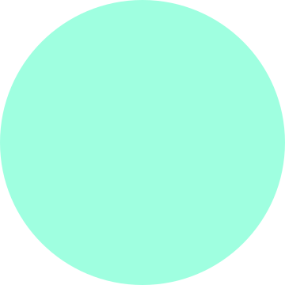

# Fuji

A multimedia file manager designed with privacy and precision in mind.

Made with
[Rust](https://www.rust-lang.org/),
[JS](https://developer.mozilla.org/en-US/docs/Web/JavaScript),
[Vue](https://vuejs.org/) and
[Vite](https://vite.dev/) in
[Tauri](https://tauri.app/).

### Workspaces

This repository is a pnpm monorepo. The application is one workspace and the website is the other. The planning documents stay at the root.

```
./desktop           the Fuji desktop application, made with Tauri
./site              the website and documentation, made with VitePress
```

### Scripts

Run `pnpm install` once at the root and it installs both workspaces. Every other command runs from inside the workspace it belongs to, so start with `cd`. The root has no scripts of its own. pnpm comes from corepack rather than a global install, and reads the `packageManager` field in the root package.json to get the version this project pins.

```
$ pnpm install

$ cd desktop
$ pnpm local        run Fuji here, in development mode with hot reload
$ pnpm compile      build the binary in release mode, and stop there
$ pnpm installer    build the installer, all the way through the app to the dmg
$ pnpm reveal       open the file manager on that installer, to run it as a user would
$ pnpm hash         stage and hash what is already built, building nothing
$ pnpm upload       send what is already staged to the production server

$ cd site
$ pnpm local        run the site here, in development mode with hot reload
$ pnpm build        build it to dist, to sanity check that works
$ pnpm upload       build it and send it to the production server
```

Common flows through the desktop commands include:

- **local / compile** — work on a feature that doesn't involve desktop integration, and check the release build.
- **installer / reveal** — install Fuji the way a user does, and test file associations, the installed icon, and anything else that needs a real install.
- **installer / hash / upload / commit & push** — publish a release, then commit. Git tracks the sidecars.

And through the site commands, there is really only one:

- **local / upload** — write or restyle a page with hot reload, then put it live. `upload` builds on its way out, so `build` is not a step in between.

We've picked unconventional script names to be clear about the smaller steps these commands perform. `compile` never makes an installer, `installer` never hashes, `hash` never builds, and `upload` never builds. The site's `upload` is the one exception, and builds before it sends.

A name does the same job on every machine. `installer` makes a `.dmg` on macOS, a `.exe` on Windows, and a `.deb` on Linux, and `upload` sends whichever one the machine you're on can build. You don't have to remember a different command per platform.

`pnpm icons` is separate from all of this. It rebuilds every platform's icons from the SVG sources. Run it by hand after you change the artwork, and after you upgrade the Tauri CLI. `icon.md` explains why that second case is easy to forget.

The JavaScript behind these commands is in one file, `scripts.js`, at the root, and each command passes it a verb. Both workspaces call it because they share facts: the stable publishing name, the bundle folder, and the file manager command for each platform. Those live in one table there.

### Publishing

An installer ships from the machine that can build it: Windows publishes the exe, macOS the dmg, Linux the deb. The site ships over rsync from any machine that has rsync, which in practice is the Mac. Windows can't, and says so clearly instead of failing somewhere deeper.

`hash` writes a small JSON sidecar next to each installer holding its size, hash, version and date. Installers are gitignored and sidecars are committed. The download page fetches those sidecars when a visitor opens it, so a new installer shows up on the site as soon as you upload it, with no site deploy. If you skip `hash`, the upload compares the sidecar against the file next to it, sees they disagree, and stops.

Both `upload` commands read `.env` at the root for the server address and account details. The installer upload also needs an SSH key, belonging to a restricted account which can write the downloads directory and nothing else, while the site upload uses an administrative account. Neither the file nor the key is in git: `.gitignore` covers `.env`, and the key lives outside the repository. Set each machine up once from notes kept offline.

Downloading the installer from fujidesktop.app is different again. A browser marks a file it downloaded with the mark of the web, and that mark is what triggers SmartScreen on Windows. A copy you built locally carries no mark and runs without the warning.

### Scaffolded on macOS

The commands below are the original scaffolding from July 2025, kept as a record. Fuji moved from yarn to pnpm in August 2026.

```
$ yarn create tauri-app fuji
✔ Identifier · com.zootella.fuji
✔ Choose which language to use for your frontend · TypeScript / JavaScript - (pnpm, yarn, npm, deno, bun)
✔ Choose your package manager · yarn
✔ Choose your UI template · Vue - (https://vuejs.org/)
✔ Choose your UI flavor · JavaScript
```

### Output

Executable and installer on mac
```
./desktop/src-tauri/target/release/bundle/macos/Fuji.app
./desktop/src-tauri/target/release/bundle/dmg/Fuji_0.1.0_aarch64.dmg
```

Executable and installer on windows
```
./desktop/src-tauri/target/release/fuji.exe
./desktop/src-tauri/target/release/bundle/nsis/Fuji_0.1.0_x64-setup.exe
```

Installer on linux
```
./desktop/src-tauri/target/release/bundle/deb/Fuji_0.1.0_amd64.deb
```

Staged for publishing by `pnpm hash`, on whichever machine built it
```
./desktop/release/fuji.dmg      ./desktop/release/fuji.dmg.json
./desktop/release/fuji.exe      ./desktop/release/fuji.exe.json
./desktop/release/fuji.deb      ./desktop/release/fuji.deb.json
```

Fuji ships those four packages and no more, so `bundle.targets` names them instead of Tauri's default `"all"`, which would also build an `.msi` beside the NSIS installer and an `.AppImage` beside the Debian package. The installers themselves stay out of git; their sidecars are committed, so the repository keeps a dated record of what hash each release had.

`pnpm reveal` opens whichever of those bundle folders this platform builds into, so there is no need to walk the path by hand.

## Setup macOS

Verify or Install Xcode Command Line Tools
```
$ xcode-select -p
/Library/Developer/CommandLineTools

$ xcode-select --install
```

Confirm you can reach Apple's Clang compiler, aliased as gcc
```
$ gcc --version
Apple clang version 17.0.0 (clang-1700.0.13.5)
Target: arm64-apple-darwin24.5.0
Thread model: posix
InstalledDir: /Library/Developer/CommandLineTools/usr/bin
```

Install Rust
```
$ curl https://sh.rustup.rs -sSf | sh
$ rustc --version
rustc 1.88.0 (6b00bc388 2025-06-23)
$ cargo --version
cargo 1.88.0 (873a06493 2025-05-10)
```

## Setup Windows 10

https://visualstudio.microsoft.com/visual-cpp-build-tools/
 * Downloads and runs a 4.5mb installer
 * Visual Studio Installer, wizard starts
 * Desktop development with C++, choose that one first card

You can paste the whole block below into *PowerShell* as a single command
```
# Detect Visual Studio Build Tools with MSVC
$vsPath = & "C:\Program Files (x86)\Microsoft Visual Studio\Installer\vswhere.exe" `
  -latest -products * `
  -requires Microsoft.VisualStudio.Component.VC.Tools.x86.x64 `
  -property installationPath
# Locate MSVC toolset folder
$msvcRoot = Join-Path $vsPath "VC\Tools\MSVC"
# Get the latest MSVC version folder
$latestMsvcVersion = Get-ChildItem $msvcRoot | Sort-Object Name -Descending | Select-Object -First 1
# Build full path to cl.exe
$clPath = Join-Path $latestMsvcVersion.FullName "bin\Hostx64\x64"
# Output the resolved path
Write-Host "Resolved cl.exe path:"
Write-Host $clPath
```
Should output a path like
```
Resolved cl.exe path:
C:\Program Files (x86)\Microsoft Visual Studio\2022\BuildTools\VC\Tools\MSVC\14.44.35207\bin\Hostx64\x64
```
You only need to get it on the path for this one *PowerShell* session...
```
# Add cl.exe to the path for this session, and confirm it's there
$env:Path += ";$clPath"
Get-Command cl.exe

CommandType  Name    Version    Source
-----------  ----    -------    ------
Application  cl.exe  14.44.3... C:\Program Files (x86)\Microsoft Visua...
```

...to be able to then install the Rust toolchain
```
# Install the Rust toolchain
Invoke-WebRequest -Uri https://win.rustup.rs -OutFile rustup-init.exe
Start-Process .\rustup-init.exe
```
This pops its own command line window, *Enter* for default

Now you can see everything in [Git](https://git-scm.com/downloads/win)'s *MINGW64*
```
$ node --version, v22.21.1
$ npm --version, 10.8.1
$ corepack --version, 0.34.0
$ rustc --version, rustc 1.98.0 (88d9e12ae 2026-08-18)
$ cargo --version, cargo 1.98.0 (797e8a9bc 2026-08-05)
$ git --version, git version 2.55.0.windows.3

$ git clone https://github.com/zootella/fuji
$ cd fuji
$ pnpm install --frozen-lockfile
$ cd desktop
$ pnpm installer
$ pnpm local
```
`pnpm` isn't installed globally — it comes from corepack, which ships with Node. Run `corepack enable` once from an elevated *PowerShell*; after that `pnpm` reads the `packageManager` field in the root package.json and runs the exact version this project pins, downloading it on first use. Use `--frozen-lockfile` when you're installing what's committed rather than changing dependencies; it refuses to quietly rewrite pnpm-lock.yaml, which is what keeps one lockfile serving both mac and windows.

No global `tauri-cli` either — the `@tauri-apps/cli` in devDependencies is what `pnpm local` and `pnpm installer` run, and keeping it there means the CLI can't drift out of step with the Rust crates.

## README from scaffolding

**Tauri + Vue 3**
This template should help get you started developing with Tauri + Vue 3 in Vite. The template uses Vue 3 `<script setup>` SFCs, check out the [script setup docs](https://v3.vuejs.org/api/sfc-script-setup.html#sfc-script-setup) to learn more.

**Recommended IDE Setup**
- [VS Code](https://code.visualstudio.com/) + [Volar](https://marketplace.visualstudio.com/items?itemName=Vue.volar) + [Tauri](https://marketplace.visualstudio.com/items?itemName=tauri-apps.tauri-vscode) + [rust-analyzer](https://marketplace.visualstudio.com/items?itemName=rust-lang.rust-analyzer)
