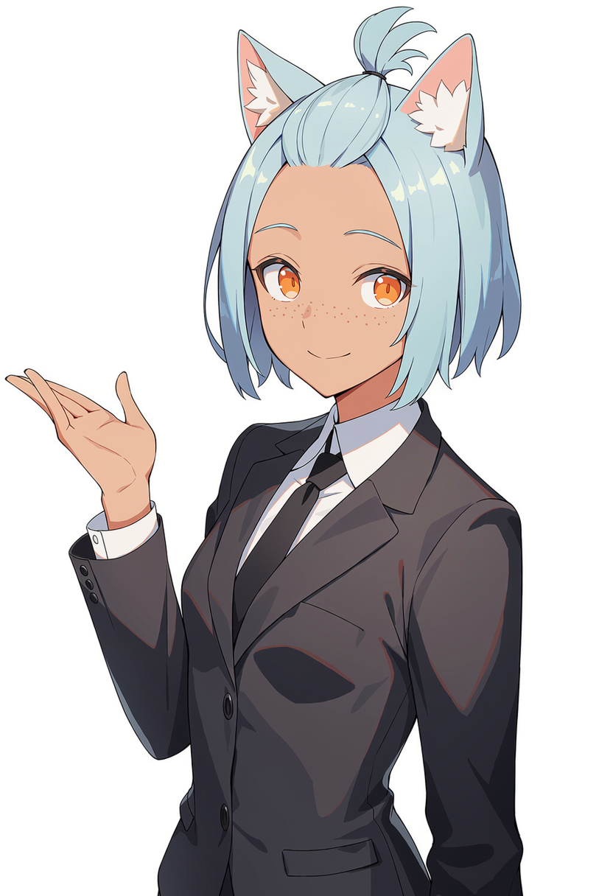

# Meet Aki

**Aki Fujisawa**　藤沢 明希

Blood type A　／　Shizuoka　／　Hobbies: coffee houses, letterpress printing

Meet Aki, the face of our project. She handles reception and visitor scheduling at our Kanda office, along with the difficult task of persuading the development team to eat lunch. Ask her about Jinbōchō and she will tell you which shops still keep their old print catalogues in the back. She says the best part of the job is meeting people from companies she'd only read about in magazines.

明希は当プロジェクトの顔です。神田事務所にて受付および来客対応を担当しており、あわせて開発チームに昼食をとらせるという難題も引き受けております。神保町の話を振れば、古い印刷見本帳を今も奥に置いている店を教えてくれます。雑誌でしか知らなかった会社の方々にお会いできるのが、この仕事の一番の楽しみだそうです。

